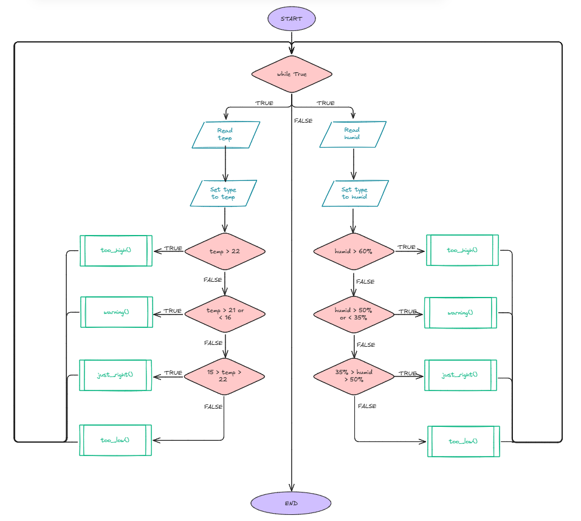
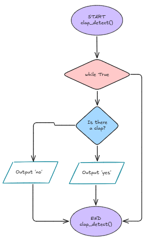
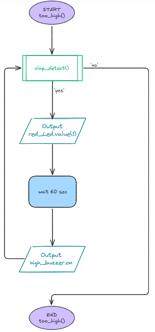

# Requirements Outline
## The Need
When it is cold and damp, mould has a potential to grow. At night time, rain can also dampen windows or hot air could be stuck inside your bedroom and you wouldn't know about it. I need to create something that will allow me to know when to open and close windows and have a way to turn it off in the night.
## Proposed Solution
The solution that could be implemented is to ake a Raspberry Pi program that includes four primary sensors: a temperature sensor and humidity detector to detect their respective areas, a buzzer when the humidity or temperature reaches a certain level, and a small sound to detect the calpping of hands or other noise. LEDs could also be implemented to show how close the humidity and temperature is to being damp or cold respectively, or as a subtitute to a buzzer. 
## Key Actions
 - Temperature Sensor and Humidity Detector detects temperature and humidity respectivelty outside of the designated range. It does this every 5 seconds.
 - A red or blue LED light is turned on depending on if it's above range (red) or below range (blue)
 - Different pitched buzzer sounds alerts user of the temperature or humidity out of place
 - A clap from the user turns the buzzer off
## Functional Requirements
The designated temperature range is 15-22 degrees celsius, as they are the least likely conditions for mould to grow. 

This is paired with a humidity at between 30 - 50%, because mould germinates most in humidity of 60% or more.

Both the temperature and humidity will have a set of LEDs each for distinguishing the difference.

A red LED will turn on when the temperature is above 22 degrees celsius, or when the humidity is above 60%. After one minute without any clap detected, a high-pitched buzzer will turn on as well. This acts as the 'too high' label

A yellow LED will turn on when the temperature is at 15 or 22 degrees celsius or the humidity is between 55% and 60%. This acts as a warning for movement into the red LED areas.

A green LED will turn on and remain on as long as the temperature is between 16 and 21 degrees celsius and the humidity is between 30 and 55%. This acts as the 'just right' label and should be maintained most of the time.

A blue LED will turn on when the temperature is below 15 degrees celsius or the humidity is below 30%. After one minute without any clap detected, a low-pitched buzzer will turn on as well. This acts as the 'too low' label.

A sound sensor detects a clap when the red LED or blue LED are turned on. At a certain noise level the sound sensor will disable all buzzers for 10 minutes to allow time to fix the humidity and temperature levels
## Test Cases
| Test Case | Input     | Expected Output   |
|---------- |---------- |----------------   |
| Temperatue too hot | Temperature sensor reads above 22 degrees celsius | Red LED turns on. after 1 minute a high-pitched buzzer turns on |
| Temperature in high range | Temperature sensor reads 22 degrees celsius | Yellow LED turns on |
| Temperature in medium range | Temperature sensor reads 16-21 degrees celsius | Green LED turns on |
| Temperature in low range | Temperature sensor reads 15 degrees celsius | Yellow LED turns on |
| Temperature too cold | Temperature sensor reads below 15 degrees celsius | Blue LED turns on. After 1 minute a low-pitched buzzer turns on |
| Humidity too high | Humidity detector reads above 60% | Red LED turns on. after 1 minute a high-pitched buzzer turns on |
| Humidity in high range | Humidity detector reads 55-60% | Yellow LED turns on |
| Humidity in medium range | Humidity detector reads 35-55% | Green LED turns on |
| Humidity in low range | Humidity detector reads 30-35% | Yellow LED turns on |
| Humidity too cold | Humidity detector reads below 30% | Blue LED turns on. After 1 minute a low-pitched buzzer turns on |
| Sharp clap detected | Sound sensor detects hertz between 2200 and 2800 | All buzzers are disabled and turned off for 10 minutes | 
## Non-Functional Requirements
### Efficiency:
The robot will need to detect both the temperature and humidity using their respective sensor, doing this every 5 seconds for maximum efficiency. The clap should be detected every 0.1 seconds to ensure a fast and connected correlation. It can't run out of battery or randomly stop working in the middle of the day - it must remain consistently on throughout. All LEDs need to function properly and by themselves, attached to GPIO pins to reserve other pins for more the more important sensors.
### Response Time
The robot should detect the temperature and humidity respectively every 5 seconds for maximum efficiency. The clap should be detected every 0.1 seconds to ensure a fast and connected correlation. 
### Accuracy:
The robot needs to measure the temperature and humidity fairly accurately, to one decimal place. It must detect the difference between a sharp clap and other loud sound to avoid unwanted periods where buzzers are disabled. The clap should also only work 10 minutes after the last clap to avoid stacking. 
# Algorithms
## Flowcharts




## Pseudocode
```
BEGIN
WHILE TRUE
    INPUT temp
    IF temp is greater than 22 THEN
        too_high()
    ELIF temp is 15 or 22 THEN
        warning()
    ELIF temp is greater than 15 THEN
        just_right()
    ELSE
        too_low()
    ENDIF
    INPUT moist
    IF moist is greater than 60% THEN
        too_high()
    ELIF moist is 30%-35% or 50%-60% THEN
        warning()
    ELIF moist is greater than 35% THEN
        just_right()
    ELSE
        too_low()
    ENDIF
    ENDWHILE
END

BEGIN too_high()
clap_detect()
IF clap_detect RETURNS 'yes' THEN
    OUTPUT red_Led.value(1)
    wait (60)
    OUTPUT high_buzzer.on
END too_high()

BEGIN clap_detect()
WHILE TRUE
    IF clap_detected THEN
        OUTPUT 'yes'
    ELSE
        OUTPUT 'no'
END clap_detect()
```

# Development and Integration
``` Python
""" The purpose of this successful test was to see if the sound sensor would work when a sharp sound (like a clap or snap of fingers) would activate a random LED. This is the combination of the future sound sensor and a look at the main loop & how LEDs will react, and then to add LEDs and the temperature/humidity sensor. """

from machine import Pin, PWM # Connects the Raspberry Pi pins to Thonny
from time import sleep # Allows for the use of the sleep() function

# Initialization of GPIO18 as input
digital = Pin(18,Pin.IN, Pin.PULL_UP) # This is the setup for the sound sensor
r_led = Pin(16, Pin.OUT)
y_led = Pin(15, Pin.OUT)
g_led = Pin(14, Pin.OUT)
b_led = Pin(13, Pin.OUT)

r_led.value(0)
y_led.value(0)
g_led.value(0)
b_led.value(0) # The LED begins off

print("KY-037 Microphone test")

def too_high():
    while temperature > 22 or humidity > 60:
        current_led = red_led
        clap_detect()    

        if clap_detect == True:
            red_led.value(0)
            # buzzer.value(0)
            break

        red_led.value(1)
        condition_read()

def warning():
    while True:
        current_led = yellow_led
        clap_detect()   

        if clap_detect == True:
            yellow_led.value(0)
            break
        else:
            yellow_led.value(1)

        condition_read()

def just_right():
    while True:
        current_led = green_led
        clap_detect()       

        if clap_detect == True:
            green_led.value(0)
            break
        else:
            green_led.value(1)

        condition_read()

def too_low():
    while True:
        current_led = blue_led
        clap_detect()       

        if clap_detect == True:
            blue_led.value(0)
            # buzzer.value(0)
            break
        else:
            blue_led.value(1)
            sleep(60)
            # buzzer.value(1)

        condition_read()
""" This while loop is reading the environment every 0.1 seconds to check for any sounds, specifically sharp sounds, which will turn the test LED on """

while True: # Continues until break occurs
    digital_value = digital.value() # Creating a variable based on the sound sensor input
    print(digital_value) # Used as a test to see the difference in binary
    if digital_value == 1: # The digital value at 1 represents a noise being made
        led.value(0) # Unsure why, but the (0) in this turns the LED on for 0.1 seconds
        sleep(0.1)
    else:
        led.value(1) # Unsure why, but this keeps the LED off
    if temperature > 22:
            issue = "temperature"
            too_high()         
    elif temperature == 22 or temperature == 15:
            issue = "temperature"
            warning()
    elif 15 > temperature > 22:
            issue = "temperature"
            just_right()
    else:
            issue = "temperature"
            too_low()


    """ This is where humidity will go """
    if humidity > 60:
            issue = "humidity"
            too_high()
    elif 55 >= humidity >= 60 or 30 >= humidity >= 35:
            issue = "humidity"
            warning()
    elif 35 > humidity > 55:
            issue = "humidity"
            just_right()
    else:
            issue = "humidity"
            too_low()  

""" This unsure circumstance between the LED values will be fixed in a later evaluation. """
```
# Testing and Debugging
## Case Outlines
### Test Case 1 - Too Hot
I added this function into my code, however it doesn't include the implementation of the buzzer, or the timer that goes with it.
### Test Case 2 & 4 - Nearly Too Hot and Nearly too Cold
My warning function works smoothly, and completely fulfills the test case requirements. However, the functionality of the warning could be enhanced with a single buzzer sound instead of a continuous alarm. 
### Test Case 3 - Just Right Temperature
Similar to the warning function, the just_right function works smoothly, and won't need any buzzers as it is safe range. The range could possibly be increased but it's good for now.
### Test Case 5 - Too Cold
Similar to the too_hot function, this one will need a buzzer, however one with lower pitch so that there is a distinguishable difference between the two.
### Test Cases 6 - 10 - Humidity
These test cases are almost exact copies of the the first 5, however they are with humidity. This one will be harder to measure, and I will require the purchase of a humidity sensor to fulfill my original requirements.
### Test Case 11 - The Sound Sensor
As of now, the sound sensor works, however it only works in turning on an LED for a split second. Therefore, I will have to problem solve and figure out some ways to get it to turn off buzzers and LEDs. One way is to generally 'reverse' the current code so that it sets a value to 0 instead of 1. Alternatively, I could research properties between Raspberry Pi Pico sensors to see if there's anything else that could result in a successful clap. I also have to keep in mind the hertz range, which was researched by looking up how much hertz a shark sound (like a clap) is.

## Tests
### Test 1: Too High 
``` Python
""" The first test I'm going to try is the test case of if it is too hot, or humid, a red LED will turn on. We will do the buzzer next once this works. """

from machine import Pin # This will allow us to use the breadboard pins
from utime import sleep # Allows use of the sleep function
from dht import DHT11 # Allows use of the temperature/humidity sensor

""" Variable assigning - this also assigns certain sensors and devices to pins on the Pico. """
dht11_sensor = DHT11(Pin(14, Pin.IN, Pin.PULL_UP))
red_led = Pin(27, Pin.OUT)

""" This variable will come in use later. """
issue = ""

""" This function was created so that the temperature and humidity can now be read outside of the main loop/function, which is imperative for switching between LEDs without having to use a sound sensor. """
def condition_read():
    dht11_sensor.measure() # Built in function with the DHT11 that measures the temperature and humidity, as seen below
    temp = dht11_sensor.temperature() 
    humi = dht11_sensor.humidity()
    print("Temperature: {}°C   Humidity: {:.0f}% ".format(temp, humi)) # This is more of a visual for me to make sure that the device is working
    print()
    sleep(2) # First example of the sleep function. The number in the brackets corresponds to seconds

""" This function will be made more complex with the inclusion of the sound sensor, but for now its only purpose is to turn on a red LED until the temperature and humidity shift out of the dedicated region. """
def too_high(): 
    while temp > 22 or humi > 60: # This ensures that while these conditions are met, the LED will stay red.
        red_led.value(1) # Turns on the LED
        condition_read() # Ensures that temperature and humidity remain recorded
        
while True: # This is the main loop, which will eventually be in the main function
    """ While the temp and humi variables are made reference in the function below, the main loop doesn't see these variables so for now, the temp and humi also have to be assigned on the main loop. """
    temp = dht11_sensor.temperature()
    humi = dht11_sensor.humidity()
    condition_read()
    
    """ This section will become more apparent in its use later on. """
    if temp > 22: # Requirement to run through the too_high function
        issue = "temperature"
        too_high()
    if humi > 60: # Requirement to run through the too_high function
        issue = "humidity"
        too_high()
        
    red_led.value(0) # Makes sure to turn off the LED in case it was on from before
```

Both of these test cases worked (2/11 test cases half-complete)

(From now on, I will add to this code instead of seperating them so I can lay the groundwork and move up to the sound sensor.)
### Test 2: Too High (with buzzers)
``` Python
""" Not as much was added in this test, however this leaves the groundwork for all future LED test cases. The main focus of this was to test the buzzer and implement a timer function. """
from machine import Pin, PWM, Timer # Adds the Timer import for the in-built timer function
from utime import sleep
from dht import DHT11

dht11_sensor = DHT11(Pin(14, Pin.IN, Pin.PULL_UP))
pwm = PWM(Pin(9)) # Assigning of the buzzer to a pin
red_led = Pin(27, Pin.OUT)
issue = ""

pwm.freq(800) # As shown in the test cases, the buzzer has been set to a high frequency

""" The purpose of this new function correlates with the in-built timer. After a minute of the red LED being on, this function will begin and not stop until the robot is turned off, and later when the sound sensor detects a sharp noise. """
def minute(timer): # This timer correlates to the mode seen later
    while True: # Ensures that the buzzer continues even after the timer has reset
        pwm.duty_u16(32768) # Half of 35535, half volume
        sleep(1) 
        pwm.duty_u16(0) # no volume, creates an alarm sound
        sleep(1)

def condition_read():
    dht11_sensor.measure()
    temp = dht11_sensor.temperature()
    humi = dht11_sensor.humidity()
    print("Temperature: {}°C   Humidity: {:.0f}% ".format(temp, humi))
    print()
    sleep(2)

""" This function was finally complete with the implementation of the timer. The role of the timer is to create a background stopwatch that doesn't interfere with the loop. """
def too_high():
    timer = Timer() # Assigns the timer to the in-built function
    timer.init(mode=Timer.PERIODIC, period = 60000, callback=minute) # The mode I explained above, but the period is the time in milliseconds (this is exactly a minute) and the callback is the function that occurs after the minute
    while temp > 22 or humi > 60:
        red_led.value(1)
        condition_read()
        
        
while True:
    temp = dht11_sensor.temperature()
    humi = dht11_sensor.humidity()
    condition_read()
    
    if temp > 22:
        issue = "temperature"
        too_high()
    if humi > 60:
        issue = "humidity"
        too_high()
        
    red_led.value(0)
""" Otherwise, now its time to focus on the other LEDs and how they differ. I will create a system that changes the LED based on the temperature and humidity. """
```

Now the first 2 test cases have been fully complete. Now I need to complete the bulk of the test cases: the other LEDs that vary slightly in characteristiscs.

### Test 3: Other LEDs (Warning, Just Right & Too Low)
``` Python
""" This was, and probably will be, the biggest change in the project. While I was filling out the other lights, I noticed a problem: only the temperature would read. This was due to the temperature being stuck in a while loop, so I removed that and instead added a new set of LEDs for humidity, different through the first letters: t and h. I used this as well as knowledge of functions to create a system where it will only read if t or h is True. Now the only while loop is the main loop, and there is a flashing effect with the LEDs. """
from machine import Pin, PWM, Timer
from utime import sleep
from dht import DHT11

dht11_sensor = DHT11(Pin(14, Pin.IN, Pin.PULL_UP))
pwm = PWM(Pin(13))

""" As I explained earlier, I seperated the LEDs into temperture-related and humidity related. """
t_yellow_led = Pin(16, Pin.OUT)
t_blue_led = Pin(26, Pin.OUT)
t_red_led = Pin(27, Pin.OUT)
t_green_led = Pin(28, Pin.OUT)

h_red_led = Pin(0, Pin.OUT)
h_yellow_led = Pin(1, Pin.OUT)
h_green_led = Pin(2, Pin.OUT)
h_blue_led = Pin(3, Pin.OUT)

timer = Timer() # This needs to be stated before all of the functions

LEDs = [t_yellow_led, t_blue_led, t_red_led, t_green_led, h_red_led, h_yellow_led, h_green_led, h_blue_led] # Used to turn off all LEDs and create the flashing effect.

def minute(timer):
    while True:
        pwm.duty_u16(32768)
        sleep(1)
        pwm.duty_u16(0)
        sleep(1)
        
""" As you can see, I changed the start_buzzer function to be a little bit more readable and accurate with the function use. The stop_buzzer function will stop the timer and turn any buzzer off when the temperature or humidity naturally change. """
def start_buzzer(freq=800, period_ms=60000):
    timer.init(mode=Timer.PERIODIC, period = period_ms, callback=minute)
    
def stop_buzzer():
    timer.deinit() # Turns off the timer
    pwm.duty_u16(0)

def condition_read():
    dht11_sensor.measure()
    temp = dht11_sensor.temperature()
    humi = dht11_sensor.humidity()
    print("Temperature: {}°C   Humidity: {:.0f}% ".format(temp, humi))
    print()

""" I'll use this function as the example for the other three. The LED functions how have a t=false and h=false attached to them which will be resolved in the main loop to see what LEDs will turn on. Then it will turn on the selected LED. """
def too_high(t=False, h=False): # Both are originally set to false though can be changed in the main loop.
    pwm.freq(800)
    start_buzzer(freq=800, period_ms=60000)
    if t: # This correlates to if t or h is true from the main loop
        t_red_led.value(1)
    if h:
        h_red_led.value(1)
        
def warning(t=False, h=False):
    stop_buzzer()
    if t:
        t_yellow_led.value(1)
    if h:
        h_yellow_led.value(1)  
    
def just_right(t=False, h=False):
    stop_buzzer()
    if t:
        t_green_led.value(1)
    if h:
        h_green_led.value(1)    
    
def too_low(t=False, h=False):
    pwm.freq(500)
    start_buzzer(freq=800, period_ms=60000)
    if t:
        t_blue_led.value(1)
    if h:
        h_blue_led.value(1)
      

while True:
    for x in LEDs:
        (x).value(0) # This turns off all LEDs, ready for another cycle of reading

    temp = dht11_sensor.temperature()
    humi = dht11_sensor.humidity()
    condition_read()
    
    """ Here is the main if/else tree. Depending on the temperature and humidity will depend on what function is chosen and allow their respective LED. """
    if temp > 22:
            too_high(t=True) # Sets this to true so that the specific LED turns on
    elif temp == 22 or temp == 15:
            warning(t=True)
    elif 15 > temp > 22:
            just_right(t=True)
    elif temp < 22:
            too_low(t=True)
            
    if humi > 60:
            too_high(h=True)
    elif 30 >= humi >= 35 or 55 >= humi >= 60:
            warning(h=True)
    elif 35 > humi > 55:
            just_right(h=True)
    elif humi < 30:
            too_low(h=True)
            
    sleep(2) # This has been moved to the end to allow for a full, uninterupted loop

""" This update was huge, allowing for change in LEDs every 2 seconds, allowance to turn the buzzer off, and most importantly, the ability to view the state of both temperature and humidity seperately. """
```
10/11 Test Cases complete. Hardest one left.
### Test 4: Sound Detection
``` Python
""" In this test, I debugged the final test case - the sound sensor. However, I had a different original idea, which was inspired by the site https://sensorkit.joy-it.net/en/sensors/ky-037. This sample code was just to check if something was on or off, which I adapted into turning on the LED. However, this became more of a challenge with a full-flowing loop, so I created a very simple first model that will be enhanced to set a timer to the buzzer being used again. This ome just included the return part of the function and the turning off of a buzzer, however this will expand to LEDs too."""

from machine import Pin, PWM, Timer
from utime import sleep
from dht import DHT11

digital = Pin(18, Pin.IN, Pin.PULL_UP) # Sets up the sound sensor pin
dht11_sensor = DHT11(Pin(14, Pin.IN, Pin.PULL_UP))
pwm = PWM(Pin(13))

t_yellow_led = Pin(16, Pin.OUT)
t_blue_led = Pin(26, Pin.OUT)
t_red_led = Pin(27, Pin.OUT)
t_green_led = Pin(28, Pin.OUT)

h_red_led = Pin(0, Pin.OUT)
h_yellow_led = Pin(1, Pin.OUT)
h_green_led = Pin(2, Pin.OUT)
h_blue_led = Pin(3, Pin.OUT)

""" When designing the sound sensor, I ran into a problem regarding the buzzer - the timer would reset every time the temperature and humidity were checked, which led to no buzzer. To fix this, I created a True/False statement that read if the buzzer was active, and if it was the timer would continue. """

buzzer_timer = Timer()
buzzer_active = False # The variable used to see if the timer could be turned on

LEDs = [t_yellow_led, t_blue_led, t_red_led, t_green_led, h_red_led, h_yellow_led, h_green_led, h_blue_led]

def clap_detect(): # My very early function that will be enhanced later, most likely with a true/false variable
    return digital.value() == 1 # Reads the value, and if it gets signal, the function returns

def toggle_buzzer(timer): # I created a toggle_buzzer timer to create the alarm sound and link to callback
    if pwm.duty_u16() == 0:
        pwm.duty_u16(32768)
    else:
        pwm.duty_u16(0)

def minute(timer):
    buzzer_timer.init(mode=Timer.PERIODIC, period=1000, callback=toggle_buzzer)

def start_buzzer(freq=800):
    global buzzer_active # Used the in-built global function to allow its use outside of the main loop
    if buzzer_active: # Returns if the buzzer is active
        return
    buzzer_active = True # Sets buzzer to true
    pwm.freq(freq)
    buzzer_timer.init(mode=Timer.ONE_SHOT, period=60000, callback=minute)

def stop_buzzer(): # I used the same code as I added in the start_buzzer function to turn this off
    global buzzer_active 
    buzzer_active = False
    buzzer_timer.deinit()
    pwm.duty_u16(0)

def condition_read():
    dht11_sensor.measure()
    temp = dht11_sensor.temperature()
    humi = dht11_sensor.humidity()
    print("Temperature: {}°C   Humidity: {:.0f}% ".format(temp, humi))
    print()
    return temp, humi

def too_high(t=False, h=False):
    start_buzzer(800) # Now the frequency is attached to the buzzer, not the period_ms part
    if t:
        t_red_led.value(1)
    if h:
        h_red_led.value(1)

def warning(t=False, h=False):
    if t:
        t_yellow_led.value(1)
    if h:
        h_yellow_led.value(1)

def just_right(t=False, h=False):
    if t:
        t_green_led.value(1)
    if h:
        h_green_led.value(1)

def too_low(t=False, h=False):
    start_buzzer(500) # Buzzer at a lower frequency
    if t:
        t_blue_led.value(1)
    if h:
        h_blue_led.value(1)

while True:
    for x in LEDs:
        x.value(0)

    dht11_sensor.measure()
    temp = dht11_sensor.temperature()
    humi = dht11_sensor.humidity()

    print("Temperature: {}°C  Humidity: {}%".format(temp, humi))

    if clap_detect(): # Here is the link between the function and main loop where the buzzer turns off (turns the variable to False)
        stop_buzzer()

    if temp > 22:
        too_high(t=True)
    elif temp == 22 or temp == 15:
        warning(t=True)
    elif 15 < temp < 22:
        just_right(t=True)
    else:
        too_low(t=True)

    if humi > 60:
        too_high(h=True)
    elif (55 <= humi <= 60) or (30 <= humi <= 35):
        warning(h=True)
    elif 35 < humi <= 55:
        just_right(h=True)
    else:
        too_low(h=True)

    sleep(2)
```
All test cases complete. However, there are ways that will improve the usefulness, accuracy and reliability of this robot.
### Test 5: Cleanup and Quality of Life
``` Python

```

## Test Case Evaluations
### Test Cases 1 and 6: too_high() Function:

### Test Cases 2, 4, 7 and 9: warning() Function:

### Test Cases 3 and 8: just_right() Function:

### Test Cases 5 and 10: too_low() Function:

### Test Case 11: clap_detect() Function:

# Evaluation